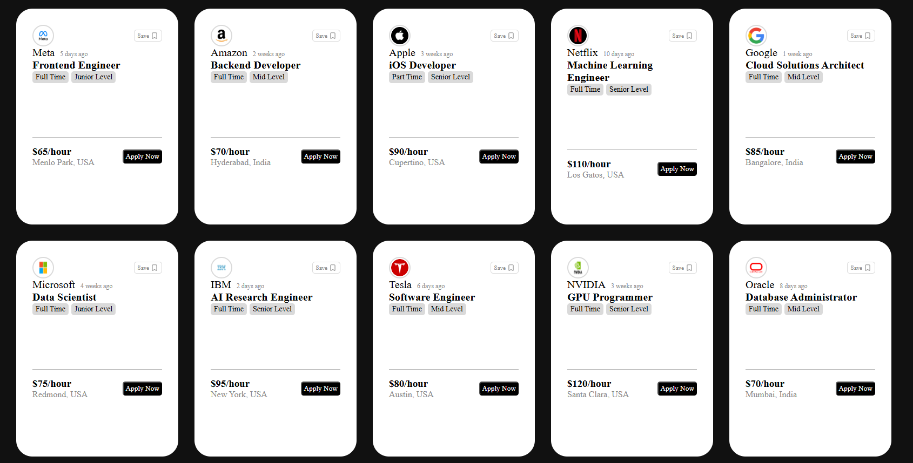

# 💼 Job Cards UI (React + Vite)

A simple and responsive job listing UI built using React and Vite.
This project displays multiple job cards with company details, job roles, salary, and an apply button.

---

## 🚀 Features

* Reusable Card Component
* Props-based dynamic data rendering
* Clean and minimal UI design
* Flexbox layout for card arrangement
* Icon integration using lucide-react
* Beginner-friendly React structure

---

## 🛠️ Tech Stack

* React (Vite)
* JavaScript (ES6)
* CSS (Flexbox)
* Lucide React Icons

---

## 📂 Project Structure

src/ 
├── components/ 
│     └── Card.jsx 
├── assets/ 
├── App.jsx 
├── main.jsx 

---

## 📸 Preview

This project showcases job cards for companies like:

* Meta – Frontend Engineer
* Amazon – Backend Developer
* Apple – iOS Developer
* Google – Cloud Solutions Architect
* Microsoft – Data Scientist
* IBM – AI Research Engineer

## 📸 Screenshot

---

## ⚙️ Installation & Setup

1. Clone the repository:
   git clone https://github.com/your-username/react-card-project.git

2. Navigate to the project folder:
   cd react-card-project

3. Install dependencies:
   npm install

4. Start the development server:
   npm run dev

5. Open in browser:
   http://localhost:5173/

---

## 📌 Learning Outcomes

* Understanding React components
* Using props for reusable UI
* Handling images and icons in React
* Styling with CSS and Flexbox
* Project structuring in React (Vite)

---

## ✨ Future Improvements

* Add search and filtering functionality
* Improve responsiveness for mobile devices
* Add animations and hover effects
* Connect to a backend API for real data

---

## 🙌 Author

Made by Tanishka
